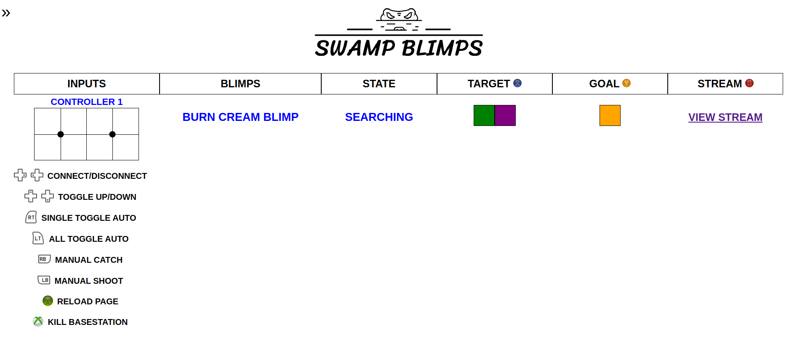

# SWAMP Blimps Basestation 🎈💻🎮

## Summary
- The basestation is used as an interface between human operators and blimps
- [BasestationV3](V3_ws) is the latest working version (Python UI with ROS2)
- [BasestationV4](V4) is in-development (Web-based UI with ROS2)

## Description
The "basestation" has been used since the beginning of SWAMP Blimps and serves as an interface between human operators and our swarm of blimps. For most of its history, the basestation has taken the form of a Python program, with a UI rendered with Pygame (shown below).

The primary functions of the basestation are:
- List all inputs (keyboard, controllers)
    - Show previews of joystick input
- List all blimps
    - Show whether blimp is in manual/autonomous mode (by text color)
    - Show states of blimps
    - Allow operator to set target goal and enemy colors
- Allow operators to connect specific inputs to specific blimps